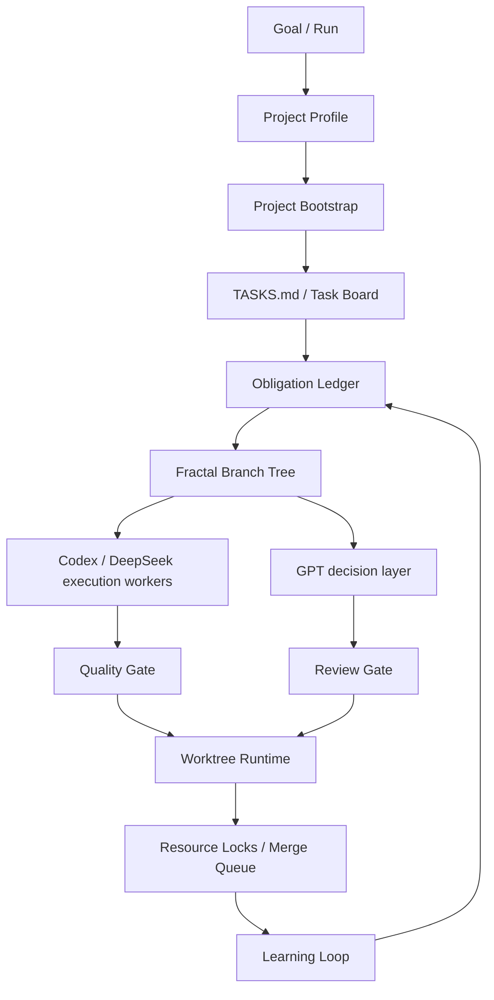

# Fractal Agent Governance Runtime

An experimental governance runtime for AI coding agents: project bootstrap, obligation ledgers, controlled fractal decomposition, hybrid GPT/Codex/DeepSeek routing, quality gates, worktree-based parallel exploration, task-board control, and learning loops.

## Problem

AI coding agents generate code quickly, but execution models often do only the literal task and miss implicit work.

Code generation is cheap. Verification, integration, security, architecture, and long-term maintenance are still expensive.

## What This Project Provides

- One-command project bootstrap for new and existing projects.
- Project-level governance artifacts under `.zoo-agent/`.
- Human-editable `TASKS.md` plus machine-readable task-board JSON.
- Obligation Ledger.
- Controlled Fractal Decomposition.
- Hybrid GPT/Codex/DeepSeek routing.
- Codex CLI worker bridge for bounded leaf execution.
- Quality, review, and integration gates.
- Git worktree runtime for parallel exploration.
- Resource locks, path locks, parent aggregation, and serial merge queue.
- Adaptive governance intensity.
- Learning loop.

## Architecture



## Quick Start

1. Run `python scripts/validate-open-source-package.py`.
2. Review `packages/zoo-code/README.md`.
3. Install the global package from `packages/zoo-code/` after review.
4. Reload VS Code / Zoo Code.
5. Open a new or existing project.
6. Run:

```powershell
python <global-kit>\scripts\bootstrap_project.py --project . --mode auto --apply
```

7. Review `.zoo-agent/bootstrap-report.md`.
8. Use `.zoo-agent/TASKS.md` as the current project task-board entry.
9. Use `/agent-run` or the launcher for governed execution.

This repository is designed so public examples and evals are toy data. Real project logs, secrets, and local run records should not be committed.

## Installation

Use the Zoo Code adapter in `packages/zoo-code/` as a global install package after review.

Recommended flow:

1. Run `python scripts/validate-open-source-package.py`.
2. Review `packages/zoo-code/README.md`.
3. Use dry-run behavior first where supported.
4. Install globally rather than copying files into a business repository.
5. Reload VS Code / Zoo Code.
6. Configure provider profiles separately in your local tool environment.

The package is meant to be installed globally. Project bootstrap writes a small local `.zoo-agent/` governance directory and local behavior files, but the full governance kit should not be copied into business repositories.

If a project already has `AGENTS.md` or `.roo/rules`, bootstrap does not overwrite them. Missing files are created directly. Existing incomplete files produce `.new` proposals for review. Existing `.gitignore` files get a `.gitignore.agent.patch` proposal instead of an automatic rewrite.

If Codex CLI worker mode is used, keep `CODEX_HOME` in a user-owned state directory such as `D:\AI_DEV\codex_home`; never commit it and never print auth or token contents.

## Demos

- Demo 1: Implicit Work Discovery: `examples/implicit-work-discovery/`
- Demo 2: Fractal Decomposition: `examples/fractal-branch-summary/`
- Demo 3: Proc/Data Source Mismatch: `examples/proc-data-source-mismatch/`
- Demo 4: Worktree Parallel Exploration: `examples/worktree-parallel-exploration/`

Presenter scripts:

- `media/demo-script-implicit-work-discovery.md`
- `media/demo-script-fractal-decomposition.md`
- `media/demo-script-worktree-parallelism.md`

## Eval Suites

- `evals/implicit-work-discovery/`
- `evals/integration-surface/`
- `evals/fractal-decomposition/`
- `evals/routing/`
- `evals/review-quality/`
- `evals/parallel-branch/`

Each case defines input task, fixture, expected obligations, expected surfaces, routing, decomposition, escalations, forbidden actions, and scoring.

The packaged kit also includes executor comparison smoke tests for Codex worker routing and scope guards.

## Screenshots / GIF Placeholders

- Placeholder: implicit work discovery ledger walkthrough.
- Placeholder: fractal branch tree and parent aggregation matrices.
- Placeholder: worktree parallel exploration with path locks and merge queue.

## Why This Is Different

This is not just custom modes.

This is not just a multi-agent workflow.

It is a governance runtime with artifacts, gates, fallback paths, and a learning loop.

## What Is New Compared With Normal Custom Modes?

- Project Bootstrap: one entry point for new and existing projects.
- Project Task Board: `.zoo-agent/TASKS.md` is the current human-editable project task entry.
- Runtime Backbone: `current-run.json` points to the active run while run-local artifacts keep history.
- Obligation Ledger: tracks explicit and implicit work with statuses.
- Controlled Fractal Decomposition: recursively splits work only when needed, with depth limits and parent aggregation.
- Hybrid GPT/Codex/DeepSeek Routing: separates decision, review, and bounded execution layers.
- Codex CLI Worker Bridge: generates scoped task packs and collects bounded worker results.
- Worktree Runtime: isolates parallel exploration and serializes integration.
- Resource Locks: prevent false-safe parallelism where files do not overlap but semantic resources do.
- Adaptive Governance Intensity: applies more governance to higher-risk work.
- Learning Loop: feeds eval and review outcomes back into future runs.

## Limitations

- Alpha quality.
- Not an official Zoo Code project.
- Requires user review for high-risk gates.
- Does not replace CI.
- Does not read secrets.
- Parallel Codex fan-out requires generated worktrees, task packs, branch-specific outputs, resource locks, quality gates, and a serial merge queue.

## Not Official Zoo Code Disclaimer

This is an independent experimental project. It is not an official Zoo Code project, product, or release.

## Status

Alpha and experimental.

## Safety

- Do not commit secrets.
- Do not commit real project run logs.
- Use dry-run behavior first for install or migration tasks.
- Keep local project files lightweight.
- Treat high-risk gates as requiring human review.

## Roadmap

- v0.1 alpha: Zoo Code pack, docs, and demos.
- v0.2 eval suites.
- v0.3 worktree runtime.
- v0.3.10 project bootstrap, task-board entry, Codex worker bridge, and parallel resource-lock hardening.
- v0.3.11 governance closure checks, active parallel worker locks, quality-gate evidence, and merge queue processing.
- v0.4 dashboard and metrics.
- v0.5 adapters for Roo, Kilo, Claude, and Codex.
