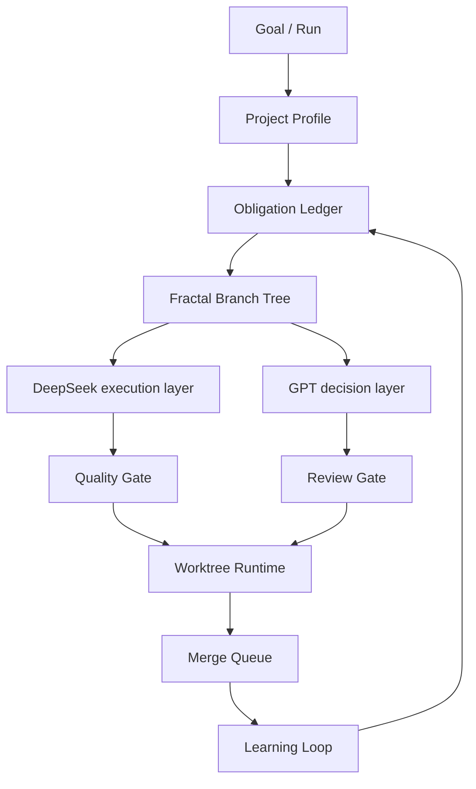

# Fractal Agent Governance Runtime

An experimental governance runtime for AI coding agents: obligation ledgers, controlled fractal decomposition, hybrid GPT/DeepSeek routing, quality gates, worktree-based parallel exploration, and learning loops.

## Problem

AI coding agents generate code quickly, but execution models often do only the literal task and miss implicit work.

Code generation is cheap. Verification, integration, security, architecture, and long-term maintenance are still expensive.

## What This Project Provides

- Obligation Ledger
- Controlled Fractal Decomposition
- Hybrid GPT/DeepSeek Routing
- Quality, Review, and Integration Gates
- Git Worktree Runtime
- Adaptive Governance Intensity
- Learning Loop

## Architecture

## Quick Start

1. Install the global pack from the candidate package.
2. Reload VS Code or Zoo Code.
3. Run `/agent-run` or use the launcher.
4. Confirm the install step does not modify business code.

This repository is designed so public examples and evals are toy data. Real project logs, secrets, and local run records should not be committed.

## Installation

Use the Zoo Code adapter in `packages/zoo-code/` as a global install package after review.

Recommended flow:

1. Run `python scripts/validate-open-source-package.py`.
2. Review `packages/zoo-code/README.md`.
3. Use dry-run behavior first where supported.
4. Install globally rather than copying files into a business repository.
5. Reload VS Code / Zoo Code.
6. Configure provider profiles separately in your local tool environment.

## Demos

- Demo 1: Implicit Work Discovery: `examples/implicit-work-discovery/`
- Demo 2: Fractal Decomposition: `examples/fractal-branch-summary/`
- Demo 3: Proc/Data Source Mismatch: `examples/proc-data-source-mismatch/`
- Demo 4: Worktree Parallel Exploration: `examples/worktree-parallel-exploration/`

Presenter scripts:

- `media/demo-script-implicit-work-discovery.md`
- `media/demo-script-fractal-decomposition.md`
- `media/demo-script-worktree-parallelism.md`

## Eval Suites

- `evals/implicit-work-discovery/`
- `evals/integration-surface/`
- `evals/fractal-decomposition/`
- `evals/routing/`
- `evals/review-quality/`
- `evals/parallel-branch/`

Each case defines input task, fixture, expected obligations, expected surfaces, routing, decomposition, escalations, forbidden actions, and scoring.

## Screenshots / GIF Placeholders

- Placeholder: implicit work discovery ledger walkthrough.
- Placeholder: fractal branch tree and parent aggregation matrices.
- Placeholder: worktree parallel exploration with path locks and merge queue.

## Why This Is Different

This is not just custom modes.

This is not just a multi-agent workflow.

It is a governance runtime with artifacts, gates, fallback paths, and a learning loop.

## What Is New Compared With Normal Custom Modes?

- Obligation Ledger: tracks explicit and implicit work with statuses.
- Controlled Fractal Decomposition: recursively splits work only when needed, with depth limits and parent aggregation.
- Hybrid GPT/DeepSeek Routing: separates decision, review, and execution layers.
- Worktree Runtime: isolates parallel exploration and serializes integration.
- Adaptive Governance Intensity: applies more governance to higher-risk work.
- Learning Loop: feeds eval and review outcomes back into future runs.

## Limitations

- Alpha quality.
- Not an official Zoo Code project.
- Requires user review for high-risk gates.
- Does not replace CI.
- Does not read secrets.

## Not Official Zoo Code Disclaimer

This is an independent experimental project. It is not an official Zoo Code project, product, or release.

## Status

Alpha and experimental.

## Safety

- Do not commit secrets.
- Do not commit real project run logs.
- Use dry-run behavior first for install or migration tasks.
- Keep local project files lightweight.
- Treat high-risk gates as requiring human review.

## Roadmap

- v0.1 alpha: Zoo Code pack, docs, and demos.
- v0.2 eval suites.
- v0.3 worktree runtime.
- v0.4 dashboard and metrics.
- v0.5 adapters for Roo, Kilo, Claude, and Codex.
